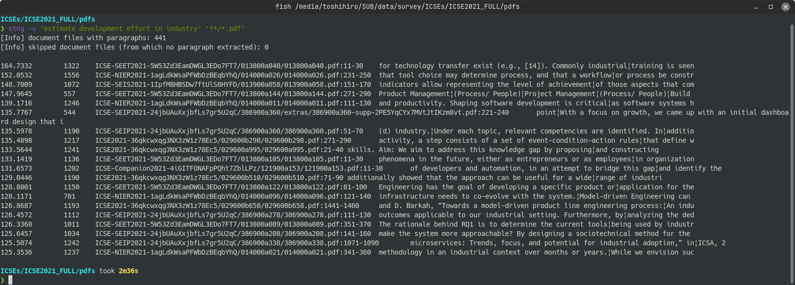

# stng

stng, a sentence-transformer-based natural-language grep.

The `stng` is an off-the-shelf grep-like tool that performs semantic similarity search.
With Sentence Transformer models, search document files that contain similar parts to query.
Supports searching within text files (.txt), PDF files (.pdf), and MS Word files (.docx).

It is recommended to run this tool on a PC equipped with a GPU, as it performs calculations with PyTorch.

## Installation

**⚠️ `stng` is currently an alpha, HIGHLY EXPERIMENTAL product.**

Before installing `stng` with pip, please install the following dependencies.

* pdftotext (poppler)
* pandoc
* docopt-ng (or docopt)

Windows:

```
choco install poppler
choco install pandoc
python -m pip install docopt-ng
python -m pip install stng
```

Mac:

```
brew install poppler
brew install pandoc
python3 -m pip install docopt-ng
python3 -m pip install stng
```

Ubuntu:

```
sudo apt install poppler-utils
sudo apt install pandoc
python3 -m pip install docopt-ng
python3 -m pip install stng
```

## TL;DR (typical usage)

Search for the document files similar to the query phrase.

```sh
stng -v <query_phrase> <document_files>...
```

Example of search:  


## Links

* Sentence-BERT https://www.sbert.net/

* Reimers, N., Gurevych, I., Sentence-BERT: Sentence Embeddings using Siamese BERT-Networks, Proceedings of the 2019 Conference on Empirical Methods in Natural Language Processing, 2019. https://arxiv.org/abs/1908.10084

## Release History

#### 0.3.0

* fix: change to use a `pdftotext` command (instead of a library) to simplify installation

#### 0.2.1

* fix: some of the input files were not being read

#### 0.2.0

* feat: new option --quote to show paragraph of the search result instead of excerpt
* fix: optimization in reading pdf and docx files
* fix: option -n was renamed to option -k

#### 0.1.1

* fix: replace model with sentence-transformers/stsb-xlm-r-multilingual

#### 0.1.0

* First release
